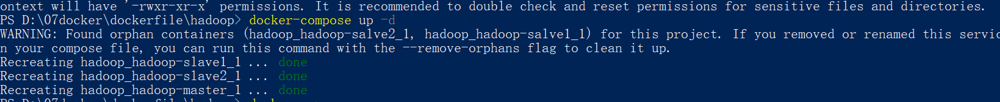

# Hadoop 使用docker-compose 构造一个master-2slave的小集群

> 分享感谢 https://github.com/kiwenlau/hadoop-cluster-docker


## 安装


1. clone项目

> git clone https://github.com/wuhulala/dockerfile.git

2. build（可略过）

> docker build -t wuhulala/hadoop:2.7.7 -f ./master/Dockerfile .

略过直接使用

```
docker pull registry.cn-hangzhou.aliyuncs.com/wuhulala/hadoop:2.7.7
```

3. 进入hadoop 目录

> docker-compose up -d 



4. 进入master

> docker exec -it hadoop_hadoop-master_1 /bin/bash

5. 启动

> [root@638f1a499aa5 bin]# /root/start-master.sh

## 定制化节点

1. clone项目

> git clone https://github.com/wuhulala/dockerfile.git

2. 修改`\hadoop\common\config\slaves`

```
hadoop-slave1
hadoop-slave2
hadoop-slave3
hadoop-slave4
```

3. 重新build

```shell
docker build -t wuhulala/hadoop:2.7.7 -f ./master/Dockerfile .
```

4. 重新启动`docker-compose`

```shell
docker-compose up -d 
```


